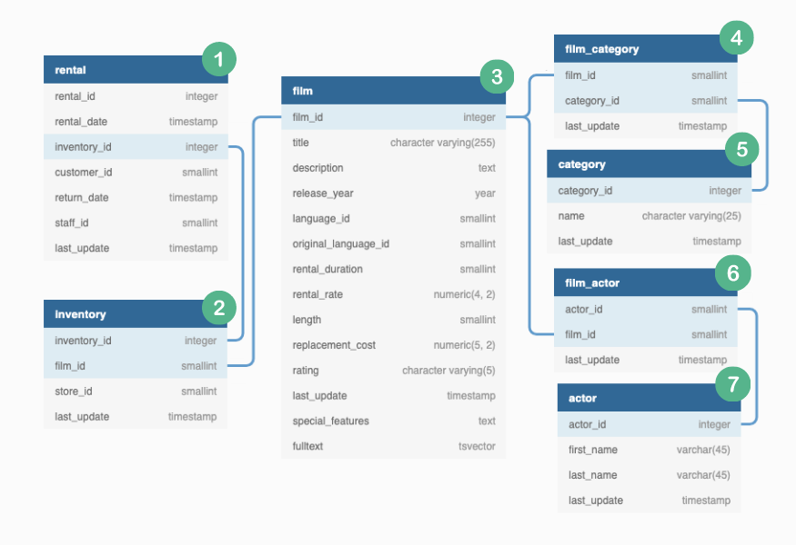

## Exploratory Data Analysis
---

Have a look at diagram below which shows all table provided by DVD Rental Co. and their inter-relationships. 

Looking at [business questions](../README.md#📀-business-problem) and these tables, it is clear we need to join the table and peroform some intese calculations to get the desired results we want.

While performing table join our only point of concern is if there is any data loss w.r.t. customer or not. other than that we are also concerned about avoiding duplicates unless they are important. 

Lets begin!

I have here created crux of my analysis. 

| left_table | right_table | foreign_key |Join type| output_name | Analysis | 
|--|--|--|--|--|--|
|rental|inventory|inventory_id|INNER| table_join_1 |  
|inventory|film|film_id|INNER|table_join_2| |
|film|film_category|film_id|INNER|table_join_3||kv
|film_category|category|category_id|INNER|table_join_4||

